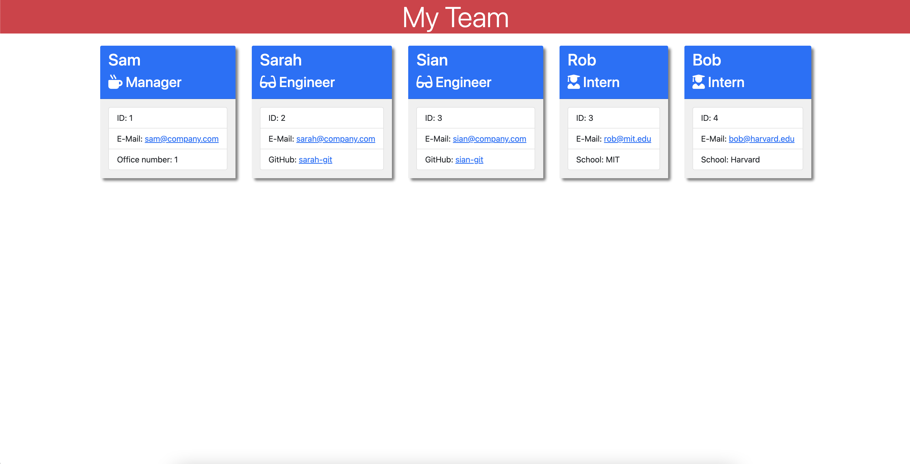

  # Team Profile Generator

  
  
  ## Table of Contents 
  - [Description](#description)
  - [Installation](#installation)
  - [Usage](#usage)
  - [Contributions](#contributions)
  - [Tests](#test)
  - [License](#license)
  - [Questions](#questions)
  

## Description

This project is a generator that allows the user to create a webpage company directory. This project is a `Node.js` command line application with file generation.

## Installation

First, the user should use `git clone` to copy this repository. Once this is complete, running `npm i` will install all needed dependencies. 

## Usage
Here is a GIF demonstrating functionality:

To view a higher resolution version of this video, please navigate to my [Google Drive](https://drive.google.com/file/d/14suLGlgqpKQcwuaSyqOSHOaX4EbvXML6/view).

To run the actual program, enter `npm index`. You will then be taken through a series of prompts to find out the composition of your team. This will start with the manager and then allow the user to enter in as many engineers and interns as they have. At the end of the process, the user will find the generated HTML document in the dist folder.

A sample webpage can be found [here](./dist/index.html).

Here is a screenshot:

## Contributions

Thank you to classmates Eric Kirberger and Azime Nail, tutor Dru Sanchez, and TAs Paul Cwik and Justyn Subrai for their guidance with this project. 

## Tests

To run the test suite, simply enter `npm test`. This will initiate the `jest` testing suite. Please see 

## License
This project is licensed under the MIT license.
    

## Questions
See more of my work [here!](https://github.com/sam-lerner) 

I can be reached via e-mail at sam.a.lerner@gmail.com. Thank you for reading!

